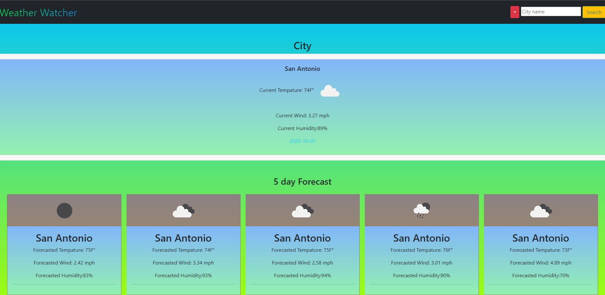

# Week6Weather
Week 6 challenge, a Weather viewing website.

## Description

sixth Week - A weather Website, that will pull from a third party API and populate data from it to our website. Functions Include: search for a city, a Previous City selection, 
Weather, Wind and Humidity for the city as well as a 5 day forecast.

## Links

Github Link: https://github.com/codyleight/Week6Weather
Deployed Website : https://codyleight.github.io/Week6Weather/

## Usage

Search a city name up and view the current (Approximate) Weather as well as a 5 day forecast.
## Credits

Cody Thompson
Repo location on pc: - C:\Users\JC\Desktop\Bootcamp2\Week6Weather
Used previous Week examples
Used Xpert Learning Assistant, to condense some parts of my code as well as for assistance in some bug fixes.

## Photo Preview of Website
 
